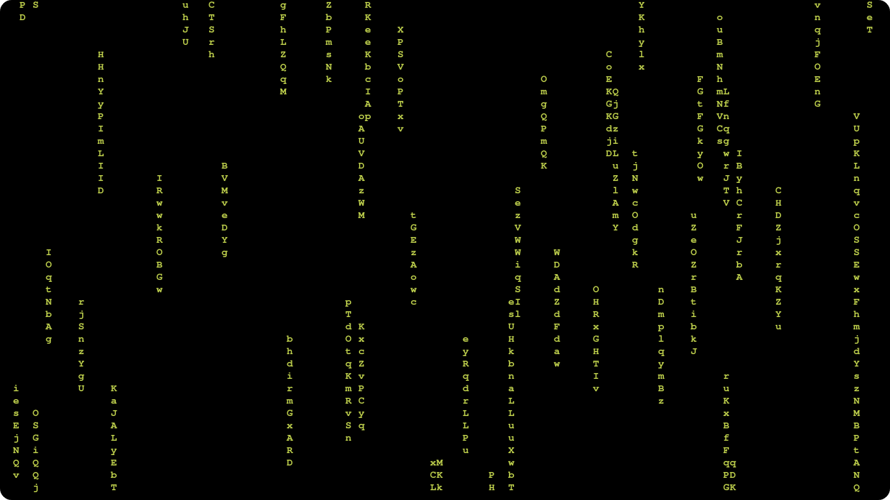

<div align="center">
    <h2>R-matrix</h2>
    
</div>
<h1>

## What's that 
R-matrix is a matrix for terminal interfaces written in Rust programming language, the program support window resizes.

### Compilation code
```sh
cargo build
```

### By default the program run just calling it
```sh
./rmatrix
```

## Costumizations
The R-Matrix is costumizable, and can change color of background/foreground, string size and speed of operations using some CLI arguments.

### Matrix foreground colors
If you wan't change the color of matrix's chars, you could use this flag.

```sh
--foreground or -f
```
    
### Matrix background colors
If you wan't change the background color of matrix, you could use this flag.

```sh
--background or -b
```

### Available matrix colors
These are the acceptable colors for matrix foreground/background, any color that isn't here will result in an error.
<ul>
    <li>Black</li>
    <li>Gray</li>
    <li>Blue</li>
    <li>Cyan</li>
    <li>Green</li>
    <li>Magenta</li>
    <li>Red</li>
    <li>White</li>
    <li>Yellow</li>
    <li>BrightBlue</li>
    <li>BrightCyan</li>
    <li>BrightGreen</li>
    <li>BrightMagenta</li>
    <li>BrightRed</li>
    <li>BrightWhite</li>
    <li>BrightYellow</li>
</ul>

## Matrix string size
If you are using a terminal that need to be small, you would wish change the string size, the default is max: 12 and minimum: 8. The max string size NEVER can be less or equal than minimum string size.

### Specifying minimum size
For change the minimum size of matrix string size you could use this flag. This accept an integer number.

```sh
--min-string-size or -m <MIN_STRING_SIZE>
```

### Specifying the max size
For change the max size of matrix string size you could use this flag. This accept an integer number.

```sh
--max-string-size or -M <MAX_STRING_SIZE>
```

### Matrix redraw
The R-matrix accept some arguments that make the rendering more slow or fast. You can define the time that the render thread uses to sleep and then, doing this effect. The time is in milliseconds.

```sh
--matrix_redraw-cooldown or -r <MATRIX_REDRAW_COOLDOWN>
```

### Matrix string generator
This program uses another thread to generate strings randomly in terminal screen, and you can define the time in milliseconds that each string is generated.

```sh
--matrix_string_generator_cooldown or -s <MATRIX_STRING_GENERATOR_COOLDOWN>
```

### Using it as inactivity background
Exists some ways to stop the program, the most common is just hitting ctrl + c, however, this won't clear the terminal and reset all colors (if changed by program call). The better way is just hitting enter when focusing the terminal, this will show your cursor back, clear the terminal and reset all colors.

## Goodbye